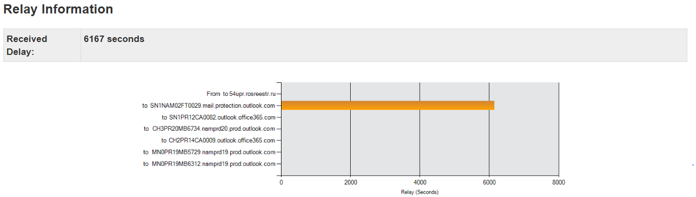
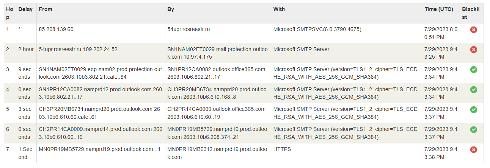

# Phishing Email Analysis

## Overview
The key objective of this project is to replicate a real-world phishing email analysis to identify and critically evaluate indicators of compromise. The complete analysis process was performed on a VM to avoid any accidental exposure. The phishing email sample was obtained from the 'phishing_pot' GitHub repository, confirming it as a phishing email. The email header was analyzed to validate sender information and routing path. The extracted IOCs from the email header were enriched using OSINT tools like VirusTotal, AbuseIPDB, and MXToolbox. The OSINT tools did not provide any evidence of malicious activities related to the IPs, the main reason being the age of the email sample. SPF failure, missing DKIM signature, and absence of DMARC policy were the most prominent indicators of a phishing email. The email body highlighted social engineering tactics including urgency, authority, and reward. By summarizing all IOCs, the sample was declared as an Advance Fee Fraud.

  
  

---

## Tools Used

| Tool | Purpose |
|---|---|
| MXToolbox Email Header Analyzer | Email header analysis and routing path visualization |
| VirusTotal | IP reputation and malicious activity check |
| AbuseIPDB | IP abuse confidence score check |
| Notepad++ | Raw email header viewing and analysis |

---

## IOC Summary

| IOC | Category | Description |
|---|---|---|
| Additional suspicious hops | Email Header | Email routed from Germany through compromised Russian government server to obfuscate true sender identity |
| 2 hour delivery delay | Email Header | 2 hour delay on Russian relay server indicating long queue of emails — possibly a well-organized mass phishing campaign |
| Email Spoofing | Email Header | 54upr.rosreestr.ru spoofed as postfiji.com.fj mail server |
| Failed SPF | Email Header | 109.202.24.52 not authorized to send email on behalf of postfiji.com.fj, email spoofing revealed |
| Same Sender Spoofing | Email Header | From and To addresses identical (nemani[.]tukunia@postfiji[.]com[.]fj), used to confuse victim |
| Reply-To Mismatch | Email Header | Reply-To (mywoodforestbiz[.]7@gmail[.]com) differs from From address, revealing true attacker contact |
| DKIM None | Email Header | Email not cryptographically signed, authenticity unverifiable |
| Social Engineering Tactics | Email Body | Authority, reward, and urgency tactics observed to trap victim into initiating conversation |

---

## Key Learnings

- OSINT tools like VirusTotal and AbuseIPDB returned clean results due to the age of the email sample — clean tool results do not confirm an email is legitimate
- Email authentication failures (SPF, DKIM, DMARC) are stronger indicators than IP reputation scores
- SMTP protocol has no built-in authentication — any server can claim to send emails from any domain. SPF, DKIM and DMARC were invented to address this weakness
- A 2 hour delay on a relay server can indicate a bulk/mass phishing campaign
- True attacker contact is often hidden in Reply-To field, not the From address
- Weight of evidence approach is essential — multiple weak indicators together confirm malicious intent

---

## Conclusion

A real-world phishing email was deeply analyzed in this project to gain familiarity with common indicators of compromise and to gain hands-on experience as a security analyst. IOCs like additional suspicious delivery hops, 2 hour delivery delay, email spoofing, failed SPF, missing DKIM, Same Sender Spoofing, missing DMARC policy, and social engineering tactics were observed in the email. By summarizing all these IOCs, this email can clearly be classified as a phishing email, specifically an Advance Fee Fraud, where the attacker's objective was to harvest the victim's personal details and ultimately trap them into paying advance fees to claim a non-existent reward.

---

## Certifications
- Google Cybersecurity Professional Certificate
- CompTIA Security+

---

## Connect
- **LinkedIn:** www.linkedin.com/in/muhammad-umer01

